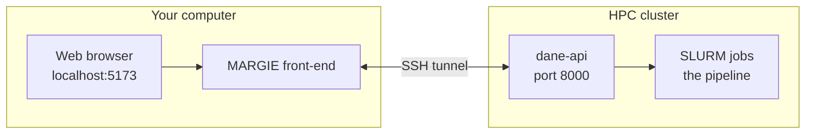

<div align="center">

# MARGIE | Graphical User Interface (GUI)

**Mostly Automated Rapid Genome Inference Environment**
<br>
Start a genome-annotation run, watch it on the cluster, and read your results — all from your web browser.
<br>
Runs on **macOS** | **Windows** | **Linux**.
<br><br>
[](https://bsp.anvilcloud.rcac.purdue.edu/)
[](https://github.com/sajalbhattarai/bioinformatics-tools)
[](https://kit.svelte.dev/)

<a href="#what-you-need"><b>What you need</b></a> &nbsp;|&nbsp;
<a href="#quick-start"><b>Quick start</b></a> &nbsp;|&nbsp;
<a href="#windows"><b>Windows</b></a> &nbsp;|&nbsp;
<a href="#ai-usage-in-the-project"><b>AI usage in the project</b></a> &nbsp;|&nbsp;
<a href="#more-details"><b>More details</b></a>

</div>

## Repo scope

This repository is the **frontend** repository for MARGIE.
It contains GUI code and launcher/setup flow for browser-based usage.
It does **not** contain backend pipeline implementation details.

For backend pipeline, CLI, API, and backend runtime/config details, use **[bioinformatics-tools](https://github.com/sajalbhattarai/bioinformatics-tools)**.

## What you need

- An account on your HPC cluster, with SSH set up — the same login you normally use to reach it.
- **Node.js** (20.19+ | 22.12+ | 24 or newer), **Git**, **SSH client**, **curl**.
- On Windows: **WSL (Ubuntu)** is required and setup must run inside WSL.

Check what is already installed:

```bash
./setup.sh --check
```

Install required packages inside Ubuntu/WSL if needed:

```bash
sudo apt update
sudo apt install -y git openssh-client curl
```

Install a supported Node.js version:

```bash
curl -fsSL https://deb.nodesource.com/setup_24.x | sudo -E bash -
sudo apt install -y nodejs
```

Verify:

```bash
node --version
git --version
ssh -V
curl --version
```

Example check output:

```
  node       found     v22.20.0
  git        found     /usr/bin/git
  ssh        found     /usr/bin/ssh
  curl       MISSING   checks the backend is really answering
  rsync      missing   only for: margie --sync (optional)

  verdict              missing: curl
```

## Quick start

> On Windows? Jump to **[Windows](#windows)** for the WSL flow.

### The first time

Copy the app to your computer:

```bash
git clone https://github.com/sajalbhattarai/biolab-fe.git
cd biolab-fe
```

Then run the setup once:

```bash
./setup.sh
```

It asks for three things about your cluster:

| Setup asks for | Example |
| --- | --- |
| **HPC username** — may differ from your computer's username | `abc` |
| **HPC address** | `cluster.university.edu` |
| **Path to the backend [bioinformatics-tools](https://github.com/sajalbhattarai/bioinformatics-tools) folder on the HPC** — the backend repo folder that contains `pyproject.toml` | `/home/abc/bioinformatics-tools` |

> **Prefer not to be asked?** Open `setup.sh` and fill in `HPC_USER`, `HPC_ADDR`, and `BACKEND_DIR` at the top before running — setup then skips the questions. You can change any of these later in `~/bin/margie`.

Setup then opens the app — click **Register** to create your account.

### Every time after that

Open a terminal and run one word:

```bash
margie
```

It starts the backend on the cluster, connects to it, and opens the app at **http://localhost:5173**.

<a id="windows"></a>

## Windows

Use this exact order on Windows:

1. Install and open WSL (Ubuntu)
2. Clone (or unzip) the repo
3. Run `./setup.sh` inside WSL
4. Start with `margie`

### WSL step-by-step (recommended)

Open **PowerShell as Administrator** and run:

```powershell
wsl --install -d Ubuntu
```

Restart Windows if prompted. Then open **Ubuntu** from the Start menu and finish first-run setup (create Linux username/password).

In Ubuntu, verify Linux is ready:

```bash
uname -a
```

Clone and run setup in WSL:

```bash
git clone https://github.com/sajalbhattarai/biolab-fe.git
cd biolab-fe
bash ./setup.sh
```

If your folder has a different name (for example from a ZIP download), just `cd` into that folder and run `./setup.sh`. Folder name does not matter.

During setup, Ubuntu may ask for your Linux password for `sudo` when installing required packages.

When setup completes, start MARGIE from Ubuntu:

```bash
margie
```

Open this URL in Windows browser if it does not open automatically:

```text
http://localhost:5173
```

### If setup fails

Run these checks:

```bash
wsl --status
wsl -l -v
cd /path/to/your/repo
bash ./setup.sh --check
bash ./setup.sh
```

Common fixes:

1. If WSL is not available, install it in PowerShell (Admin):

```powershell
wsl --install -d Ubuntu
```

2. If scripts have Windows line endings:

```bash
sed -i 's/\r$//' setup.sh margie-fe/scripts/*.sh
```

3. If browser does not open automatically, open:

```text
http://localhost:5173
```

<a id="more-details"></a>

## AI usage in the project

Phase 9-12 scripts were designed and implemented by **Sajal Bhattarai**.
During script development, **Claude Sonnet 4.6** was used in interactive mode to improve robustness and debug issues.
The core ideas, architecture, and intended behavior were defined by Sajal Bhattarai.
These scripts were manually validated for intended behavior.

Visualization and LLM work, including the operon circular diagram page, HTML creation, and interactive chat mode, were refined with interactive-mode assistance from **Claude Opus 4.8**.
These components were also manually checked and validated for intended purpose.

## Disclaimer

This software is provided "as is", without warranty of any kind, express or implied, including but not limited to warranties of merchantability, fitness for a particular purpose, and noninfringement.

## Cite This Repository

APA 7th (software):

Bhattarai, S., Deemer, D., & Lindemann, S. (2026). *biolab-fe* [Computer software]. https://github.com/sajalbhattarai/biolab-fe

Use the exact version you ran by checking repository Releases, and include that release version number in your citation.

Please also cite the individual tools and databases you use in the MARGIE pipeline, in accordance with their licensing and referencing requirements. The licensing gates during MARGIE runs provide the relevant licensing details, but you should still cross-check and confirm the requirements before publication.

For machine-readable repository metadata, see [CITATION.cff](CITATION.cff).

<details>
<summary><b>More details on how it works</b></summary>

### The pieces

The app on your computer doesn't do the heavy work itself. It talks to a small service called **dane-api** on the cluster through a private SSH connection, and that service hands your jobs to **SLURM** (the cluster's job scheduler):



The single `margie` command starts the service, opens the connection, and launches the app — all in one step.

On Windows, "your computer" in that diagram is WSL: the front-end and the SSH tunnel run inside Linux, and your Windows browser reaches them at `localhost:5173` as if they were running in Windows directly. Nothing else changes.

### What Register asks for

Besides a username and password, the Register page asks for your **cluster address**, your **username on the cluster**, and your **SSH key** — that's what lets the app run jobs for you. If you don't have an SSH key yet, the page shows you how to make one.

### Changing things later

- **Where the backend lives, or which cluster you use** — edit these two lines at the top of `~/bin/margie` and save (no need to run setup again). `HPC_HOST` is your login as `username@address`:

  ```bash
  export HPC_HOST="abc@cluster.university.edu"
  export BACKEND_DIR="/home/abc/bioinformatics-tools"
  ```

- **Your cluster login, and where results are saved** — open the **Profile** page in the app (under *Cluster Credentials* and *Config*).

### For developers

`margie --sync` grabs the newest front-end from the cluster before starting. If it can't reach the network, it quietly uses your local copy instead. Most people can ignore this.

The setup scripts:

| Script | What it is |
| --- | --- |
| `setup.sh` | macOS, Linux and WSL entry point. `--check` reports only \| `--yes` installs without asking. |
| `margie-fe/scripts/check-deps.sh` | The dependency check itself — same code on every platform, so what setup reports and what MARGIE needs can't drift apart. |
| `margie-fe/scripts/margie.sh` | The launcher `margie` runs. |

</details>
