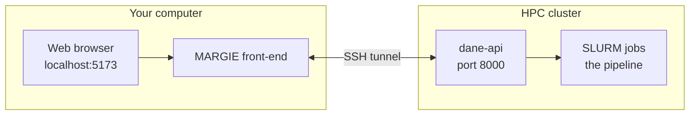

<div align="center">

# MARGIE | Graphical User Interface (GUI)

**Mostly Automated Rapid Genome Inference Environment**
<br>
Start a genome-annotation run, watch it on the cluster, and read your results — all from your web browser.
<br>
Runs on **macOS** | **Windows** | **Linux**.
<br><br>
[](https://bsp.anvilcloud.rcac.purdue.edu/)
[](https://github.com/sajalbhattarai/bioinformatics-tools)
[](https://kit.svelte.dev/)

<a href="#what-you-need"><b>What you need</b></a> &nbsp;|&nbsp;
<a href="#quick-start"><b>Quick start</b></a> &nbsp;|&nbsp;
<a href="#windows"><b>Windows</b></a> &nbsp;|&nbsp;
<a href="#acknowledgements"><b>Acknowledgements</b></a> &nbsp;|&nbsp;
<a href="#more-details"><b>More details</b></a>

</div>

<details>
<summary><b>Tip: Just want to use it?</b></summary>

You don't have to install anything. The app is already online at **[bsp.anvilcloud.rcac.purdue.edu](https://bsp.anvilcloud.rcac.purdue.edu/)**. The steps below are only if you'd like to run your own copy.

</details>

## Repo scope

This repository is the **frontend** repository for MARGIE.
It contains GUI code and launcher/setup flow for browser-based usage.
It does **not** contain backend pipeline implementation details.

For backend pipeline, CLI, API, and backend runtime/config details, use **[bioinformatics-tools](https://github.com/sajalbhattarai/bioinformatics-tools)**.

## What you need

- An account on your HPC cluster, with SSH set up — the same login you normally use to reach it.
- **Node.js** (20.19+ | 22.12+ | 24 or newer), **Git**, and on Windows, **WSL**.

**You don't have to install those yourself.** Setup checks first, tells you what is already there, and asks before installing anything that isn't:

```bash
./setup.sh --check          # macOS and Linux — just look, change nothing
```

```powershell
powershell -ExecutionPolicy Bypass -File .\setup.ps1 -Check    # Windows
```

You'll get a list like this, and anything already installed is left alone:

```
  node       found     v22.20.0
  git        found     /usr/bin/git
  ssh        found     /usr/bin/ssh
  curl       MISSING   checks the backend is really answering
  rsync      missing   only for: margie --sync (optional)

  verdict              missing: curl
```

<details>
<summary><b>Prefer to install Node.js and Git yourself?</b></summary>

**The simplest way** — download and run the official installers:

- Node.js — [nodejs.org](https://nodejs.org/) (choose the **LTS** version)
- Git — [git-scm.com/downloads](https://git-scm.com/downloads)

**Or use a package manager**

macOS — with [Homebrew](https://brew.sh):

```bash
brew install node git
```

Windows — these belong **inside WSL**, not in Windows itself, so run the Linux line below in your Ubuntu terminal. Installing Node into Windows with `winget` will not help MARGIE. (`setup.ps1` handles this for you.)

Linux, WSL — Debian or Ubuntu:

```bash
sudo apt update
sudo apt install -y nodejs npm git
```

Distribution packages are usually too old: Ubuntu 22.04 pins `nodejs` to 12 and 24.04 to 18, and neither can build this app. The version rule is not a simple floor — the toolchain wants **20.19+ | 22.12+ | 24 or newer**, and `.npmrc` sets `engine-strict=true`, so a wrong Node makes `npm install` fail outright with `EBADENGINE` rather than warn. If yours does not match, get the current LTS:

```bash
curl -fsSL https://deb.nodesource.com/setup_24.x | sudo -E bash -
sudo apt install -y nodejs
```

**Then check they're ready** — open a new terminal and run:

```bash
node --version
git --version
```

If both print a version number, and Node matches the rule above, you're all set. `./setup.sh --check` will tell you either way.

</details>

<details>
<summary><b>Don't have Node.js or Git yet?</b></summary>

**The simplest way** — download and run the official installers:

- Node.js — [nodejs.org](https://nodejs.org/) (choose the **LTS** version)
- Git — [git-scm.com/downloads](https://git-scm.com/downloads)

**Or use a package manager**

macOS — with [Homebrew](https://brew.sh):

```bash
brew install node git
```

Windows — with winget (built into Windows 10/11):

```powershell
winget install OpenJS.NodeJS Git.Git
```

Linux — Debian or Ubuntu:

```bash
sudo apt update
sudo apt install -y nodejs npm git
```

**Then check they're ready** — open a new terminal and run:

```bash
node --version
git --version
```

If both print a version number, you're all set. (Node.js should be 18 or newer — if it's older, install the LTS version from [nodejs.org](https://nodejs.org/).)

</details>

## Quick start

> On Windows? Jump to **[Windows](#windows)** — it's one command, but a different one.

### The first time

Copy the app to your computer:

```bash
git clone https://github.com/sajalbhattarai/biolab-fe.git
cd biolab-fe
```

Then run the setup once:

```bash
./setup.sh
```

It asks for three things about your cluster:

| Setup asks for | Example |
| --- | --- |
| **HPC username** — may differ from your computer's username | `jdoe` |
| **HPC address** | `cluster.university.edu` |
| **Path to the backend [bioinformatics-tools](https://github.com/sajalbhattarai/bioinformatics-tools) folder on the HPC** — the backend repo folder that contains `pyproject.toml` | `/home/jdoe/bioinformatics-tools` |

> **Prefer not to be asked?** Open `setup.sh` and fill in `HPC_USER`, `HPC_ADDR`, and `BACKEND_DIR` at the top before running — setup then skips the questions. You can change any of these later in `~/bin/margie`.

Setup then opens the app — click **Register** to create your account.

### Every time after that

Open a terminal and run one word:

```bash
margie
```

It starts the backend on the cluster, connects to it, and opens the app at **http://localhost:5173**.

<a id="windows"></a>

## Windows

Download the app, then run setup once from PowerShell:

```powershell
git clone https://github.com/sajalbhattarai/biolab-fe.git
cd biolab-fe
powershell -ExecutionPolicy Bypass -File .\setup.ps1
```

After that, `margie` works from any terminal, or from **Start menu → MARGIE**. That's the whole thing.

<details>
<summary><b>What setup does, and what it asks</b></summary>

It checks before it changes anything, and shows you the result first. Anything already installed is reported as found and skipped. Then it asks — one question at a time, and you can say no to any of them:

| It asks | What happens if you say yes |
| --- | --- |
| **Install WSL?** | Turns on Windows Subsystem for Linux — a Microsoft feature of Windows. Needs administrator rights and one restart. |
| **Install Ubuntu?** | About 1–2 GB. Ubuntu asks you to pick a Linux username and password (they're only for Linux — not your Windows or cluster login). |
| **Copy your SSH key into Linux?** | Copies `C:\Users\you\.ssh` keys into Linux, where MARGIE can use them. Nothing already there is overwritten, and nothing leaves your computer. |
| **Install Node.js and the rest?** | Only whatever was reported missing. |

It then asks the same three cluster questions as on macOS, and you're done.

If setup tells you to restart Windows, restart and run the exact same command again — everything already finished is detected and skipped.

</details>

<details>
<summary><b>Why does Windows need WSL?</b></summary>

MARGIE opens **one** SSH login to your cluster and reuses it for the tunnel and for every command it runs there. That's OpenSSH connection multiplexing (`ControlMaster`), and Windows' own `ssh.exe` doesn't implement it. The launcher also relies on Unix process and port tools that Windows doesn't have.

Rather than a second, weaker Windows-only version that would drift out of step, Windows runs the *same* MARGIE inside WSL. So a fix for one platform is a fix for all of them.

**What WSL is:** a feature of Windows itself, made by Microsoft. It is not a second operating system to boot into, it does not repartition your disk, and your Windows files stay where they are.

| | |
| --- | --- |
| **Installs to** | `%LOCALAPPDATA%\WSL` (older builds: `%LOCALAPPDATA%\Packages`) |
| **Disk space** | about 1–2 GB to start with |
| **Needs** | administrator rights, and one restart |
| **To remove it** | `wsl --unregister Ubuntu` — takes it away completely |

</details>

<details>
<summary><b>Windows troubleshooting</b></summary>

**"running scripts is disabled on this system"** — use the full command, which allows the script just this once:

```powershell
powershell -ExecutionPolicy Bypass -File .\setup.ps1
```

**"the requested operation requires elevation"** — right-click PowerShell, choose *Run as administrator*, then run it again. Setup offers to do this for you.

**WSL install fails, or the machine hangs at "installing"** — virtualization may be switched off in your BIOS/UEFI, or blocked by your organisation. Check what setup found:

```powershell
powershell -ExecutionPolicy Bypass -File .\setup.ps1 -Check
```

**You can't install anything on this laptop** — you don't have to. The app is already online at **[bsp.anvilcloud.rcac.purdue.edu](https://bsp.anvilcloud.rcac.purdue.edu/)** and needs nothing installed.

**Windows is older than build 19041** — WSL 2 can't run there. Update Windows, or use the hosted app above.

**MARGIE is slow, or the page never reloads when you edit** — it's running from the Windows disk (`/mnt/c/...`) instead of from inside Linux. Setup normally moves it for you; if you cloned it again by hand, move it:

```bash
cp -r /mnt/c/path/to/biolab-fe ~/biolab-fe && cd ~/biolab-fe && ./setup.sh
```

**Nothing opens in the browser** — open **http://localhost:5173** yourself. The app is running inside Linux, but Windows can reach it at that address.

</details>

<a id="more-details"></a>

## Acknowledgements

Phase 9-12 scripts were designed and implemented by **Sajal Bhattarai**.
During script development, **Claude Sonnet 4.6** was used in interactive mode to improve robustness and debug issues.
The core ideas, architecture, and intended behavior were defined by Sajal Bhattarai.
These scripts were manually validated for intended behavior.

Visualization and LLM work, including the operon circular diagram page, HTML creation, and interactive chat mode, were refined with interactive-mode assistance from **Claude Opus 4.8**.
These components were also manually checked and validated for intended purpose.

## Disclaimer

This software is provided "as is", without warranty of any kind, express or implied, including but not limited to warranties of merchantability, fitness for a particular purpose, and noninfringement.

<details>
<summary><b>More details on how it works</b></summary>

### The pieces

The app on your computer doesn't do the heavy work itself. It talks to a small service called **dane-api** on the cluster through a private SSH connection, and that service hands your jobs to **SLURM** (the cluster's job scheduler):



The single `margie` command starts the service, opens the connection, and launches the app — all in one step.

On Windows, "your computer" in that diagram is WSL: the front-end and the SSH tunnel run inside Linux, and your Windows browser reaches them at `localhost:5173` as if they were running in Windows directly. Nothing else changes.

### What Register asks for

Besides a username and password, the Register page asks for your **cluster address**, your **username on the cluster**, and your **SSH key** — that's what lets the app run jobs for you. If you don't have an SSH key yet, the page shows you how to make one.

### Changing things later

- **Where the backend lives, or which cluster you use** — edit these two lines at the top of `~/bin/margie` and save (no need to run setup again). `HPC_HOST` is your login as `username@address`:

  ```bash
  export HPC_HOST="jdoe@cluster.university.edu"
  export BACKEND_DIR="/home/jdoe/bioinformatics-tools"
  ```

- **Your cluster login, and where results are saved** — open the **Profile** page in the app (under *Cluster Credentials* and *Config*).

### For developers

`margie --sync` grabs the newest front-end from the cluster before starting. If it can't reach the network, it quietly uses your local copy instead. Most people can ignore this.

The setup scripts:

| Script | What it is |
| --- | --- |
| `setup.sh` | macOS, Linux and WSL entry point. `--check` reports only \| `--yes` installs without asking \| `--no-launch` sets up without starting MARGIE. |
| `setup.ps1` | Windows entry point. Checks Windows, installs WSL and Ubuntu if you agree, moves MARGIE onto the Linux disk, then hands over to `setup.sh` inside WSL. `-Check` reports only. |
| `margie-fe/scripts/check-deps.sh` | The dependency check itself — same code on every platform, so what setup reports and what MARGIE needs can't drift apart. |
| `margie-fe/scripts/wsl-bootstrap.sh` | The Linux half of the Windows installer: copies MARGIE off the Windows disk, and imports your SSH keys. |
| `margie-fe/scripts/margie.sh` | The launcher `margie` runs. |

</details>
