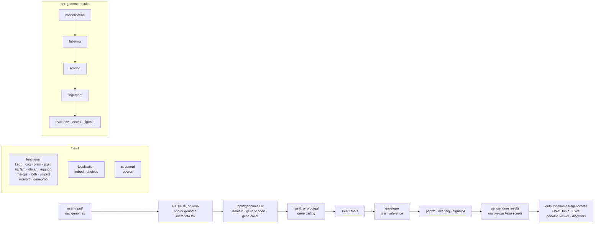

<div align="center">

# MARGIE

**Mostly Automated Rapid Genome Inference Environment**

A reproducible, container-native pipeline for whole-genome bacterial and archaeal annotation.
From a raw `.fna` assembly to functional annotations, subcellular localization, operon structure,
and per-organism fingerprints.

[](#requirements)
[](https://docs.docker.com/build/building/multi-platform/)
[](https://www.gnu.org/software/bash/)
[](LICENSE)

</div>

---

## Contents

**Part A — Getting Started**

1. [Requirements](#1-requirements)
2. [Setup](#2-setup)
3. [Running the pipeline](#3-running-the-pipeline)

**Part B — Reference**

4. [Pipeline architecture](#4-pipeline-architecture)
5. [Configuration guide](#5-configuration-guide)
6. [Tool and database catalogue](#6-tool-and-database-catalogue)
7. [Output layout](#7-output-layout)
8. [Licence compliance](#8-licence-compliance)
9. [Running on an HPC cluster with SLURM](#9-running-on-an-hpc-cluster-with-slurm)
10. [Troubleshooting](#10-troubleshooting)
11. [Repository layout](#11-repository-layout)
12. [Contributing](#12-contributing)
13. [Citations](#13-citations)

---

# Part A — Getting Started

---

## 1. Requirements

**Container runtime** — install one of the following:

| Environment | Runtime |
|---|---|
| Laptop / workstation | [Docker Desktop](https://docs.docker.com/get-docker/) — install and confirm `docker info` works |
| HPC cluster | Apptainer (usually pre-installed; confirm with `apptainer --version`) |

**Disk space** — approximately 25 GB for container images and 170 GB for reference databases.
A fast filesystem (SSD or parallel scratch) is recommended for database storage.

**Other** — `bash` 3.2+, `wget`, `tar`, `gzip`, `git` (if not available, please install these first on Linux/macOS).

**Python 3.11+** on the host, for the per-genome results (consolidation through the report figures,
margie-backend's own scripts; they run outside the containers). The first run creates
`processing/.host-env` with numpy, pandas, scipy, matplotlib and openpyxl, which needs network access
once. To use an interpreter that already has them, set `MARGIE_PYTHON=/path/to/python`.

> On Apple Silicon (M1/M2/M3), images run under Rosetta emulation inside Docker Desktop.
> This is suitable for testing; production runs should use a Linux x86\_64 HPC cluster.

---

## 2. Setup

Clone the repository and run setup once. Everything — container images and databases — is
built and downloaded automatically.

```bash
git clone https://github.com/sajalbhattarai/margie-pipeline.git
cd margie-pipeline
./setup.sh
```

`./setup.sh` does two things:
1. Builds all container images from source (this takes 1–2 hours)
2. Downloads all 18 reference databases (this takes several more hours depending on network speed)

The setup is **idempotent** — re-running it safely skips anything already present. If setup was
interrupted, just run `./setup.sh` again and it will resume from where it left off.

For a list of all setup options:
```bash
./setup.sh --help
```

> **Before running on HPC:** open `pipeline.conf.sh` and set `SLURM_ACCOUNT` to your HPC
> allocation name. See Section 5 of Part B for full configuration details.

### Licence acknowledgement (required before using gated tools)

Several tools integrated in this pipeline carry academic or non-commercial licences from
their upstream providers (MEROPS, TCDB, TMbed, InterPro, Phobius and PSORTb).
They are all **off** until you accept them, and accepting means typing this statement:

> I accept that I am using these tools for non-commercial purposes and have received all permissions from the upstream developers.

**This is a legally binding agreement. Once you accept, your use of these tools and their databases is entirely your own responsibility.**

`./setup.sh` prints each tool's terms and asks you to type the statement; the setup GUI asks
for it in Settings → Licences. You also give a short, **truthful** description of your
intended use, e.g. `academic research at <your institution>`. Both are recorded verbatim with
a timestamp and your username, reprinted in every pipeline log file, and kept in
`logs/licence-acceptances.tsv`.

Tools you have not accepted are skipped — they will not run and will not appear in any
output. See Section 8 of Part B for each tool's terms and for accepting without a terminal
(SLURM, CI).

---

## 3. Running the pipeline

### On HPC (SLURM)

```bash
# 1. Place your genome assemblies in user-input/
cp /path/to/genomes/*.fna user-input/

# 2. Classify genomes (GTDB-Tk — determines each genome's domain and genetic code)
sbatch accessory-files/slurm/annotate-classify.slurm

# 3. Wait for the classify job to finish, then run full annotation
sbatch accessory-files/slurm/annotate.slurm
```

Results appear in `output/` as each organism completes. Check job status with `squeue -u $USER`.

For all annotation options:
```bash
./annotate.sh --help
```

### On a laptop / workstation

```bash
cp /path/to/genomes/*.fna user-input/
RUN_GTDBTK=0 ./annotate.sh
```

GTDB-Tk needs far more memory than most workstations have, so turn it off with
`RUN_GTDBTK=0` (or in `pipeline.conf.sh`). RASTtk needs each genome's domain and
genetic code, which GTDB-Tk would otherwise supply; give them in
`user-input/genome-metadata.tsv` (see [Genome table](#genome-table-domain-genetic-code-and-gene-caller)).
Genomes without both are gene-called with Prodigal instead, and every later step
reads either result the same way.

### In your browser (GUI)

A browser interface in `gui/` runs everything on your own computer: add genomes, start the annotation, follow
its log, browse the results, and run setup steps. It uses the same scripts as above.

```bash
cd gui
npm install        # first time only
npm run dev        # then open http://localhost:5173
```

See [`gui/README.md`](gui/README.md) for details.

---

# Part B — Reference

---

## 4. Pipeline architecture



### Stage definitions

| Stage | Purpose | Input | Output |
|---|---|---|---|
| `gtdbtk` (optional) | GTDB-Tk taxonomy: each genome's domain and genetic code (`RUN_GTDBTK=1`) | `user-input/*.fna` | `output/gtdbtk/`, `input/classification_report.tsv` |
| genome table | Copies genomes flat into `input/` and decides each one's gene caller | `user-input/*.fna`, GTDB-Tk, `genome-metadata.tsv` | `input/<genome>.fna`, `input/genomes.tsv` |
| `rasttk` | Gene calling and base annotation via RAST-tk / BV-BRC, for genomes with a known domain and genetic code | `input/<genome>.fna` | `output/rasttk/<genome>/gene_calls/` |
| `prodigal` | Gene calling for every other genome | `input/<genome>.fna` | `output/rasttk/<genome>/gene_calls/` (same layout) |
| Tier-1 | One containerised tool per annotation type, run independently per organism | `gene_calls/genome.faa` | per-tool normalised TSV |
| `envelope` | Cell-envelope inference from tigrfam, pgap, pfam and uniprot marker hits | those four tools' TSVs | `output/envelope/<genome>/processed/envelope_summary.tsv` |
| gram-dependent | PSORTb, DeepSig and SignalP 4.1, with models chosen from the envelope call | `gene_calls/genome.faa` | per-tool normalised TSV |
| per-genome results | margie-backend's consolidation, labeling, scoring, fingerprint, evidence report, genome viewer and report figures (host scripts in `processing/host-scripts/`) | every tool's TSVs, gathered per genome | `output/genomes/<genome>/`: FINAL table, Excel copy, genome viewer, diagrams |

**Gram stain is inferred, not assumed.** Nothing about a genome's gram stain is decided before
annotation. After the tier-1 tools, the `envelope` step reads each genome's tigrfam, pgap, pfam
and uniprot results for outer-membrane and cell-wall markers and calls it
`diderm-gram-negative-like`, `monoderm-gram-positive-like` or `archaea`. Only PSORTb, DeepSig and
SignalP 4.1 use that call; selecting any of them runs those four tools too.

---

## 5. Configuration guide

All pipeline settings live in a single file: [`pipeline.conf.sh`](pipeline.conf.sh).
This file is sourced (not executed) by every script in the pipeline, so a change made here
propagates everywhere automatically.

### What you must set before first use

```bash
# In pipeline.conf.sh:

SLURM_ACCOUNT=your_account_name    # your HPC allocation (required for job submission)
BVBRC_USERNAME=your_bvbrc_username # your BV-BRC / PATRIC account (for rasttk gene calling)
LICENCE_INTENDED_USE="academic research at <your institution>"  # see Section 8
```

### Path variables — read this before changing anything

The pipeline derives all working directories from `REPO_ROOT`, which is automatically resolved
to wherever you cloned the repository. The following defaults work correctly with no changes:

| Variable | Default | What it controls |
|---|---|---|
| `REPO_ROOT` | auto-resolved (do not edit) | Repository root; all other paths derive from this |
| `USER_INPUT_DIR` | `$REPO_ROOT/user-input` | Where you place raw `.fna` genome assemblies |
| `INPUT_RASTTK` | `$REPO_ROOT/input` | Genomes copied flat (`<genome>.fna`) plus the genome table `genomes.tsv` |
| `OUTPUT_ROOT` | `$REPO_ROOT/output` | All per-tool and meta results |
| `GENOME_RESULTS_DIR` | `$OUTPUT_ROOT/genomes` | Per-genome results in margie-backend's layout |
| `MARGIE_SHARED_DIR` | `$DB_ROOT/margie-shared` | Fingerprint databases and operon reference, shared across runs |
| `DB_ROOT` | `$REPO_ROOT/db` | Reference databases |
| `SIF_DIR` | `$REPO_ROOT/processing/containers/sifs` | Apptainer SIF image cache |

> **Recommendation:** do not change path variables unless you have a specific reason and
> understand the downstream effects. Every pipeline stage chains from the previous one using
> these paths; changing one without updating the others will cause tools to fail silently or
> write to the wrong location.

If your HPC scratch volume is too small to hold databases under the repo directory, you can
redirect database storage by setting `DB_ROOT` in `pipeline.conf.sh` (not on the command line):

```bash
# In pipeline.conf.sh — set BEFORE running ./setup.sh for the first time:
DB_ROOT=/scratch/$USER/margie-dbs
```

Setting it in the config file ensures that both `setup.sh` (which downloads the databases)
and `annotate.sh` (which reads them at runtime) see the same path. Passing it only on
the command line during setup would mean the pipeline cannot find the databases when annotating.

### Genome table: domain, genetic code and gene caller

Each run writes `input/genomes.tsv`, one row per genome in `user-input/`: its domain, its genetic
code, and the gene caller used for it. RASTtk needs both the domain and the genetic code;
genomes without them are gene-called with Prodigal.

| Variable | Default | Description |
|---|---|---|
| `RUN_GTDBTK` | `1` | `1`: classify genomes with GTDB-Tk first (needs a high-memory machine). `0`: skip it |
| `GENOME_METADATA` | `user-input/genome-metadata.tsv` | Your own domain and genetic code per genome; overrides GTDB-Tk |

`genome-metadata.tsv` is tab-separated, with a header row and the genome's file name first:

```text
genome	domain	genetic_code
E_coli_K12.fna	Bacteria	11
M_genitalium.fna	Bacteria	4
Unknown_isolate.fna
```

Either value may be blank. The GUI's Analyze page edits this file as a table, and you can
paste several rows into it at once from a spreadsheet.

If a genome's gene caller changes between runs (for example, after you add its genetic code),
its earlier results are removed, because feature identifiers differ between the two callers.

### Runtime and concurrency settings

| Variable | Default | Description |
|---|---|---|
| `RUNTIME` | `auto` | Container runtime: `docker`, `podman`, `container` (Apple, macOS), `apptainer`, or `auto` (prefers apptainer) |
| `THREADS` | `8` | Default CPU threads allocated to each tool |
| `PARALLEL_TOOLS` | `6` | How many tier-1 tools run simultaneously per organism on HPC |
| `USE_GPU` | `auto` | GPU usage: `auto` (use if available), `1` (always), `0` (never) |

Peak CPU usage per organism on HPC is approximately `PARALLEL_TOOLS × THREADS + TOOL_RASTTK_THREADS`
(default: 6 × 8 + 4 = 52 cores). The annotate SLURM job is configured for 52 CPUs and 128 GB RAM
to match this default.

### SLURM settings

| Variable | Default | Description |
|---|---|---|
| `SLURM_ACCOUNT` | *(empty)* | **Set this** to your HPC allocation name; no job scripts are written without it |
| `SLURM_PARTITION` | `cpu` | Queue / partition to submit jobs to |
| `SLURM_ANNOTATE_CPUS` | `52` | CPUs requested for the annotation job |
| `SLURM_ANNOTATE_MEM` | `128G` | Memory requested for the annotation job |
| `SLURM_ANNOTATE_TIME` | `24:00:00` | Wall-clock time limit for annotation |

### Per-tool overrides

Individual tools can be overridden without touching the main settings.
The pattern is `TOOL_<toolname>_<KEY>=value`, where KEY is one of
`IMAGE`, `DB`, `THREADS`, `INPUT`, `OUTPUT`, or `POSTPROC`. Examples:

```bash
# Increase threads for a specific tool
TOOL_KEGG_THREADS=32

# Point a tool to a non-default database location
TOOL_kegg_DB=/data/shared/kegg_2024

# Disable post-processing for a tool
TOOL_rasttk_POSTPROC=""
```

All per-tool overrides are documented in the comments inside `pipeline.conf.sh`.

### BV-BRC login (for rasttk)

The `rasttk` tool uses BV-BRC (formerly PATRIC) CLI tools for gene calling. Set your username
in `pipeline.conf.sh`:

```bash
BVBRC_LOGIN=1
BVBRC_USERNAME=your_bvbrc_username
```

On the first run, the rasttk container will prompt for your password interactively and cache
the session locally (gitignored). Subsequent SLURM jobs reuse the cached session automatically.
If submitting non-interactive SLURM jobs, run `./annotate.sh --tool rasttk` once from an
interactive terminal first to cache the credentials.

---

## 6. Tool and database catalogue

### Tier-1 — annotation and feature prediction

| Tool | Function | Reference database | Licence |
|---|---|---|---|
| `rasttk` | Gene calling and base annotation (RAST-tk / BV-BRC) | rasttk | Open |
| `prodigal` | Gene calling when the genetic code is unknown (Prodigal 2.6.3) | — | GPL-3.0 |
| `kegg` | KEGG Orthology assignment via DIAMOND | kegg | Academic / FTP |
| `cog` | Clusters of Orthologous Groups (RPS-BLAST) | cog | Open (NCBI) |
| `pfam` | Protein domain families (HMMER3) | pfam | Open (CC0) |
| `pgap` | NCBI Prokaryotic Genome Annotation Pipeline | pgap | Open (NCBI) |
| `tigrfam` | TIGRfam HMM library (NCBI/J. Craig Venter) | tigrfam | Open |
| `dbcan` | Carbohydrate-active enzymes (dbCAN / run\_dbcan) | dbcan | Open |
| `eggnog` | Orthology and functional annotation (eggNOG-mapper) | eggnog | Open |
| `merops` | Peptidase classification | merops | Academic — gated |
| `tcdb` | Transporter Classification Database | tcdb | Academic — gated |
| `uniprot` | UniProt reference search via DIAMOND | uniprot | Open (CC-BY) |
| `interpro` | InterProScan integrated domain signatures | interpro | Mixed — gated |
| `geneprop` | EBI Genome Properties (requires tigrfam to run first) | geneprop | Open |
| `envelope` | Cell-envelope inference (diderm / monoderm / archaea) from marker hits | — | BSD-3-Clause |
| `psortb` | Subcellular localization, using the envelope call (PSORTb 3.0) | bundled | GPL-2.0 — gated |
| `deepsig` | Signal peptide prediction (deep learning), using the envelope call | bundled | Open |
| `tmbed` | Transmembrane topology (ProtT5 encoder, deep learning) | tmbed | CC-BY-NC-SA — gated |
| `phobius` | Combined signal peptide and TM topology prediction | bundled | Academic — gated |
| `operon` | Operon structure prediction | — | Open |

Tools marked **gated** require licence acceptance before they will run. See Section 8.

### Per-genome results — margie-backend's scripts

After a genome's tools finish, `run-meta.sh` copies its results into margie-backend's per-genome
layout (`output/genomes/<genome>/<tool>/…`, the gene calls as `rasttk/rast.*`) and runs
margie-backend's own scripts on them, with the same arguments and in the same order as a
margie-backend run. They are host scripts, not containers; `processing/host-scripts/SOURCE.md` says
which margie-backend commit they come from and how to refresh them.

| Step | What it does |
|---|---|
| consolidation | Merges every tool's results into one row per gene |
| labeling | Canonical label, EC consensus, operon membership, cluster agreement |
| scoring | Confidence tiers and the C1–C4 confidence score (C3 against the shared operon reference) |
| fingerprint | Gene and operon fingerprints, the shared fingerprint databases, the FINAL tables |
| evidence | Per-gene evidence report (`RUN_EVIDENCE`) |
| genome viewer | `FINAL_GENOME_VIEWER.html` and a circular map (`RUN_GENOME_VIEWER`) |
| report figures | Per-genome figures, and pangenome figures once every genome is done (`RUN_REPORT_FIGURES`; every operon with `RUN_FULL_OPERON_MAP=1`) |

Scoring reads operon's results, so `operon` always runs. The fingerprint databases and the operon
reference grow with every genome annotated and are kept in `MARGIE_SHARED_DIR`
(default `db/margie-shared/`), the local counterpart of margie-backend's depot files. After the last
genome, each genome folder is reduced to its FINAL table, an Excel copy, `diagrams/` and
`per-tool-phased-output/`, as margie-backend does.

### Reference databases (18 total)

| Database | Used by | Source |
|---|---|---|
| `cog` | cog | NCBI FTP |
| `dbcan` | dbcan | dbCAN portal |
| `eggnog` | eggnog | EggNOG FTP |
| `geneprop` | geneprop | EBI FTP |
| `gtdbtk` | GTDB-Tk (when `RUN_GTDBTK=1`) | GTDB-Tk data releases |
| `interpro` | interpro | EBI (full InterProScan package) |
| `kegg` | kegg | KEGG FTP (academic licence) |
| `merops` | merops | EBI MEROPS |
| `pangenome` | comparative tools | Internal |
| `pfam` | pfam | InterPro / Pfam FTP |
| `pgap` | pgap | NCBI FTP |
| `rasttk` | rasttk | BV-BRC |
| `taxonomy` | classification report, labeling | NCBI taxonomy dump |
| `tcdb` | tcdb | TCDB download |
| `tigrfam` | tigrfam, geneprop | NCBI FTP |
| `tmbed` | tmbed | HuggingFace (Rostlab/prot\_t5\_xl\_half\_uniref50-enc) |
| `type_strains` | scoring, labeling | Internal curated set |
| `uniprot` | uniprot | UniProt FTP |

All download scripts are idempotent and resumable.
See [`processing/scripts/setup-scripts/setup-databases/`](processing/scripts/setup-scripts/setup-databases/).

---

## 7. Output layout

```
input/
├── <genome>.fna                     # copied from user-input/
├── genomes.tsv                      # domain, genetic code, gene caller per genome
└── classification_report.tsv        # GTDB-Tk taxonomy (when RUN_GTDBTK=1)

output/
├── rasttk/<genome>/                 # gene calls, from RASTtk or Prodigal
│   ├── gene_calls/                  # genome.faa · genome.gff · genome.ffn · genome.fna
│   └── gene_caller.txt              # rasttk | prodigal
├── <tool>/<genome>/
│   ├── raw/                         # untouched container output (provenance-preserved)
│   └── processed/                   # normalised TSV, one row per protein
│       └── <tool>-pipeline-log.txt  # per-run provenance record
├── envelope/<genome>/processed/envelope_summary.tsv
└── genomes/                         # per-genome results, margie-backend's layout
    ├── <genome>/
    │   ├── FINAL_ANNOTATION_WITH_CONFIDENCE.tsv   # the final annotation
    │   ├── FINAL_ANNOTATION_WITH_CONFIDENCE.xlsx  # the same, coloured
    │   ├── FINAL_GENOME_VIEWER.html               # interactive genome / operon viewer
    │   ├── diagrams/                              # report figures and circular map
    │   └── per-tool-phased-output/                # every tool's table, consolidation,
    │                                              # labeling, scoring, fingerprint, evidence
    └── scoring/figures/global/                    # pangenome figures

db/margie-shared/                    # fingerprint databases + operon reference (grow across runs)
```

Each tool writes a `<tool>-pipeline-log.txt` alongside its output. These logs record
the exact command run, database version, container image, timestamps, exit codes, and
licence acceptance status — providing a full provenance record for reproducibility.

---

## 8. Licence compliance

### Why licences matter

MARGIE integrates tools and databases from many upstream providers. While the pipeline
itself is released under the MIT License, several of the bundled tools and databases
carry their own terms of use. Some are restricted to non-commercial or academic use only;
others require attribution or prohibit redistribution.

Understanding and respecting these licences is important for three reasons:

1. **Legal compliance** — using a tool outside its permitted scope can constitute a
   licence violation, even if the results are used only for research.
2. **Reproducibility** — published results must identify which tools were used; the
   pipeline records this automatically in every provenance log.
3. **Attribution** — upstream authors deserve credit for their work; citations are
   required when results are published (see Section 13).

### How the licence gate works

Tools with restricted licences are **gated** — they are off by default and will not run
unless an acceptance has been recorded. Accepting means typing this statement:

> I accept that I am using these tools for non-commercial purposes and have received all permissions from the upstream developers.

**This is a legally binding agreement. Once you accept, your use of these tools and their databases is entirely your own responsibility.**

A flag or setting on its own accepts nothing; every route needs the statement.

**Option 1 — Interactively during `./setup.sh`**: each gated tool prints its terms and asks
you to type the statement (5-minute timeout). After the first tool, the rest of that run ask
yes/no. Declining or timing out skips the tool entirely; it will not run and will not appear
in any output.

**Option 2 — In the setup GUI**: Settings → Licences. Enter your intended use, switch on the
tools you accept, and type the statement. The GUI writes Option 3's settings for you.

**Option 3 — In `pipeline.conf.sh`**, for runs with no terminal (SLURM, CI):

```bash
# A truthful description of your intended use. This is logged verbatim.
LICENCE_INTENDED_USE="academic research at <your institution>"
# The statement above, typed out.
LICENCE_STATEMENT="I accept that I am using these tools for non-commercial purposes and have received all permissions from the upstream developers."

# Then set to 1 each tool whose upstream licence you have read and meet:
LICENCE_AGREED_MEROPS=1
LICENCE_AGREED_TCDB=1
LICENCE_AGREED_TMBED=1
LICENCE_AGREED_INTERPRO=1
LICENCE_AGREED_PHOBIUS=1
LICENCE_AGREED_PSORTB=1
```

`./setup.sh`'s `--accept-<tool>-licence` and `--accept-all-licences` flags likewise count only
with `--licence-statement "<statement>"`, and so do margie-build's.

Every accepted tool is recorded with a timestamp, username, stated use case and the
statement in `logs/licence-acceptances.tsv`, with a full-text record under
`logs/licensing/`. This record is also reprinted at the top of every pipeline log file, so
collaborators and reviewers can verify exactly which tools were enabled, when, and on what
basis. Acceptances recorded before the statement was required do not count.

### Gated tools and their licences

| Tool | Licence type | Restriction | Upstream licence |
|---|---|---|---|
| `merops` | Academic / non-commercial | Commercial use requires separate agreement | [MEROPS Terms](https://www.ebi.ac.uk/merops/about/terms_of_use.shtml) |
| `tcdb` | Academic / non-commercial | Commercial use restricted | [TCDB About](https://www.tcdb.org/about.php) |
| `tmbed` | CC-BY-NC-SA 4.0 | Non-commercial; share-alike if adapted | [HuggingFace — Rostlab](https://huggingface.co/Rostlab/prot_t5_xl_half_uniref50-enc) |
| `interpro` | Mixed (per member database) | PROSITE and SMART may require commercial licences; most member DBs are open | [InterPro About](https://www.ebi.ac.uk/interpro/about/) |
| `phobius` | Academic / non-commercial | Redistribution prohibited; academic use only | [Phobius licence](https://phobius.sbc.su.se/data.html) |
| `psortb` | GPL-2.0-or-later (upstream) | Gated by this pipeline; off until accepted | [PSORTb](https://psort.org/) |

### Open-source tools in the pipeline

| Tool | Licence |
|---|---|
| MARGIE pipeline (this repository) | MIT |
| DeepSig | Open (see upstream) |
| GTDB-Tk | GPL-3.0 |
| dbCAN / run\_dbcan | Open |
| eggNOG-mapper | LGPL-3.0 |
| InterProScan (software only) | Apache-2.0 |
| All other pipeline scripts | MIT |

---

## 9. Running on an HPC cluster with SLURM

All SLURM job scripts are in [`accessory-files/slurm/`](accessory-files/slurm/).
Before submitting any jobs, confirm `SLURM_ACCOUNT` is set correctly in
[`pipeline.conf.sh`](pipeline.conf.sh).

### Step 1 — One-time setup

Run setup from a data-transfer node or a login node with internet access.
Setup builds all container images from source and downloads all 18 databases.

```bash
./setup.sh
```

The first-time setup typically takes 4–8 hours depending on network speed and
the number of cores available for image builds. If your login node enforces
a time limit, submit setup as a batch job:

```bash
sbatch --account=$SLURM_ACCOUNT --partition=cpu --time=23:00:00 --mem=32G \
       --wrap "cd $(pwd) && ./setup.sh"
```

Once setup has completed successfully, it does not need to be repeated unless
you want to add new tools or update databases.

### Step 2 — Place your genomes

```bash
cp /path/to/assemblies/*.fna user-input/
```

Place one `.fna` file per genome. The filename (without extension) becomes the
organism identifier used throughout all output directories and result tables.
Avoid spaces and special characters in filenames.

### Step 3 — Classify (GTDB-Tk)

```bash
sbatch accessory-files/slurm/annotate-classify.slurm
```

This job runs GTDB-Tk on every file in `user-input/` and writes the genome table
`input/genomes.tsv`: each genome's domain and genetic code, and so whether RASTtk
or Prodigal gene-calls it. Values in `user-input/genome-metadata.tsv` override
GTDB-Tk's. A taxonomy summary goes to `input/classification_report.tsv`.

**Wait for this job to finish before proceeding.** Check status with:

```bash
squeue -u $USER
```

### Step 4 — Full annotation

```bash
sbatch accessory-files/slurm/annotate.slurm
```

For each organism, the job runs in order:
1. **rasttk or prodigal** — gene calling, as the genome table says
2. **gram-agnostic tier-1 tools** — run in a parallel sliding window
3. **envelope** — infers the cell envelope from tigrfam, pgap, pfam and uniprot
4. **psortb, deepsig and signalp4** — run with the envelope call
5. **Per-genome results** — margie-backend's consolidation, labeling, scoring, fingerprint, evidence report, genome viewer and figures

Results appear in `output/` as each organism finishes. The pipeline is fully
idempotent — if a job is interrupted and resubmitted, completed steps are
skipped and processing resumes from where it left off.

### Useful re-run commands

| Task | Command |
|---|---|
| Re-run one specific tool for all organisms | `sbatch accessory-files/slurm/annotate-downstream.slurm --tool psortb` |
| Re-run the per-genome results only | `sbatch accessory-files/slurm/run-meta.slurm` |
| Re-run GTDB-Tk and the genome table only | `sbatch accessory-files/slurm/annotate-classify.slurm` |
| Check job status | `squeue -u $USER` |
| Follow a live tool log | `tail -f output/<tool>/<genome>/<tool>-pipeline-log.txt` |

---

## 10. Troubleshooting

| Symptom | Likely cause and fix |
|---|---|
| `docker: command not found` | Install Docker Desktop and start it |
| `Cannot connect to the Docker daemon` | Docker Desktop is not running; open it and wait for the *Running* status |
| `no space left on device` during database download | Your `DB_ROOT` directory is on a full volume; set `DB_ROOT` in `pipeline.conf.sh` to a volume with sufficient space and re-run `./setup.sh --databases-only` |
| A database download stopped partway | Re-run `./setup.sh --databases-only --tool <name>` — each download script uses sentinel files to detect partial downloads and resume |
| Want to force a re-download or rebuild of one tool | `./setup.sh --tool <name> --redo` |
| `apptainer: command not found` on a laptop | Use Docker: set `RUNTIME=docker` in `pipeline.conf.sh` |
| A tool shows no output in `processed/` | Check `output/<tool>/.../<tool>-pipeline-log.txt` for the exit code and error message |
| `geneprop` produced no output | `geneprop` requires the tigrfam domtbl to already exist; confirm tigrfam ran first |
| Classify job finishes quickly with no files in `input/` | Confirm `user-input/` contains `.fna`, `.fa` or `.fasta` files and that `setup.sh` completed the `gtdbtk` database step |
| A genome was gene-called with Prodigal, not RASTtk | Its domain or genetic code is unknown: GTDB-Tk was off or could not classify it. Add both to `user-input/genome-metadata.tsv` and re-run |
| psortb, deepsig or signalp4 skipped a genome | It has no envelope result: none of tigrfam, pgap, pfam or uniprot produced output for it |
| Tools skipped with a licence warning | Accept them: type the licence statement in `./setup.sh` or the GUI, or set `LICENCE_INTENDED_USE`, `LICENCE_STATEMENT` and `LICENCE_AGREED_<TOOL>=1` in `pipeline.conf.sh` — see Section 8 |

For verbose diagnostics, set `SET_X=1` before any command or run with `bash -x`:
```bash
SET_X=1 ./annotate.sh --tool pfam
```

---

## 11. Repository layout

```
margie-pipeline/
├── README.md
├── setup.sh                     # one-time provisioning (build images + download databases)
├── annotate.sh                  # pipeline orchestrator
├── pipeline.conf.sh             # single source of truth for all settings
│
├── user-input/                  # place raw .fna genome assemblies here
├── input/                       # genomes copied flat, plus genomes.tsv
├── output/                      # all results
├── db/                          # reference databases (default location)
│
├── accessory-files/
│   └── slurm/
│       ├── annotate-classify.slurm   # GTDB-Tk + genome table job
│       ├── annotate.slurm            # full annotation pipeline job
│       ├── annotate-downstream.slurm # re-run tier-1 tools only (skips gene calling)
│       └── run-meta.slurm            # re-run the per-genome results only
│
└── processing/
    ├── containers/
    │   ├── build/<tool>/        # per-tool Dockerfile, apptainer.def, entrypoint, scripts
    │   └── sifs/                # Apptainer SIF image cache (populated by setup.sh)
    ├── host-scripts/            # margie-backend's consolidation → figures scripts (see SOURCE.md)
    └── scripts/
        ├── shared/              # shared shell libraries (logging, runtime detection)
        ├── setup-scripts/
        │   ├── setup-containers/    # image build scripts
        │   └── setup-databases/     # database download scripts + dispatcher
        ├── run-individual-containers/  # one runner script per tool + lib/pipeline-lib.sh
        └── post-processing-raw-container-outputs/  # host-side post-processing scripts
```

---

## 12. Contributing

Issues and pull requests are welcome. To add a new annotation tool:

1. Add the tool name to `all_tier1_tools` in `pipeline.conf.sh`.
2. Add `processing/containers/build/<tool>/` with a `Dockerfile`, `apptainer.def`, `entrypoint.sh`, and `scripts/process_<tool>_raw_results.py`.
3. If the tool requires a reference database, add the name to `all_dbs` and write `processing/scripts/setup-scripts/setup-databases/download-<tool>.sh`.
4. Add the runner script at `processing/scripts/run-individual-containers/run-<tool>.sh`.

No central dispatcher needs to change — all lists are read from `pipeline.conf.sh`.

Coding conventions:

- Bash 3.2-compatible throughout (macOS default shell).
- `set -euo pipefail` in every script.
- One responsibility per file; shared logic in `lib.sh`, per-tool dispatch in individual stubs.
- All paths derived from `pipeline.conf.sh` — never hard-coded.
- All containers are built from source.

---

## 13. Citations

If MARGIE contributes to a publication, please cite the pipeline itself and the individual
tools whose results you use. A `CITATION.cff` is provided for citing the pipeline.

### Pipeline

> Bhattarai S. *et al.* MARGIE: Mostly Automated Rapid Genome Inference Environment.
> *(manuscript in preparation)*

### Tools and databases

| Tool | Citation |
|---|---|
| GTDB-Tk | Parks DH *et al.* (2022) GTDB: an ongoing census of bacterial and archaeal diversity through a phylogenetically consistent, rank normalised and complete genome-based taxonomy. *Nucleic Acids Research* 50:D785–D794. |
| RASTtk / BV-BRC | Brettin T *et al.* (2015) RASTtk: A modular and extensible implementation of the RAST algorithm for building custom annotation pipelines and annotating batches of genomes. *Scientific Reports* 5:8365. |
| PSORTb | Yu NY *et al.* (2010) PSORTb 3.0: improved protein subcellular localization prediction with refined localization subcategories and predictive capabilities for all prokaryotes. *Bioinformatics* 26:1608–1615. |
| DeepSig | Savojardo C *et al.* (2018) DeepSig: deep learning improves signal peptide detection in proteins. *Bioinformatics* 34:1690–1696. |
| TMbed | Bernhofer M *et al.* (2022) TMbed: transmembrane proteins predicted through language model embeddings. *BMC Bioinformatics* 23:326. |
| Phobius | Käll L *et al.* (2004) A combined transmembrane topology and signal peptide prediction method. *Journal of Molecular Biology* 338:1027–1036. |
| dbCAN / run\_dbcan | Yin Y *et al.* (2012) dbCAN: a web resource for automated carbohydrate-active enzyme annotation. *Nucleic Acids Research* 40:W445–W451. |
| eggNOG-mapper | Cantalapiedra CP *et al.* (2021) eggNOG-mapper v2: functional annotation, orthology assignments, and domain prediction at the metagenomic scale. *Molecular Biology and Evolution* 38:5825–5829. |
| InterProScan | Jones P *et al.* (2014) InterProScan 5: genome-scale protein function classification. *Bioinformatics* 30:1236–1240. |
| Pfam | Mistry J *et al.* (2021) Pfam: the protein families database in 2021. *Nucleic Acids Research* 49:D412–D419. |
| TIGRfam | Haft DH *et al.* (2003) TIGRFAMs and Genome Properties: tools for the assignment of molecular function and biological process in prokaryotic genomes. *Nucleic Acids Research* 31:371–373. |
| MEROPS | Rawlings ND *et al.* (2018) The MEROPS database of proteolytic enzymes, their substrates and inhibitors in 2017. *Nucleic Acids Research* 46:D624–D632. |
| TCDB | Saier MH *et al.* (2021) The Transporter Classification Database (TCDB): 2021 update. *Nucleic Acids Research* 49:D461–D467. |
| COG | Galperin MY *et al.* (2021) COG database update: focus on microbial diversity, model organisms, and widespread pathogens. *Nucleic Acids Research* 49:D274–D281. |
| UniProt | The UniProt Consortium (2023) UniProt: the universal protein knowledgebase in 2023. *Nucleic Acids Research* 51:D523–D531. |
| Genome Properties | Richardson LJ *et al.* (2019) Genome properties in 2019: a new companion database to InterPro for the inference of complete functional attributes. *Nucleic Acids Research* 47:D564–D572. |
| KEGG | Kanehisa M *et al.* (2023) KEGG for taxonomy-based analysis of pathways and genomes. *Nucleic Acids Research* 51:D587–D592. |
| PGAP | Tatusova T *et al.* (2016) NCBI prokaryotic genome annotation pipeline. *Nucleic Acids Research* 44:6614–6624. |

---

*MARGIE is released under the [MIT License](LICENSE). Bundled tools, reference databases,
and licence-restricted components retain their original licences — consult each upstream
provider before redistribution or commercial use.*
